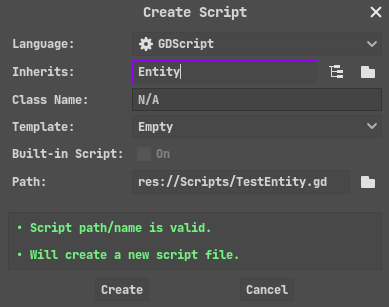

# Godot-Kinematic-Entity
A simple Godot 'Entity' class used to slightly simplify the 'Entity coding process'.

# Requirements
* Godot Engine v3.x
* 2D-Oriented Project

# Usage
* Place the `Entity.gd` script into your project directory.
* Create a new script that inherits from the newly added `Entity` class.

* Attach the script to a node of type `KinematicBody2D`
* Override the existing methods to add custom behavior to the Entity.
